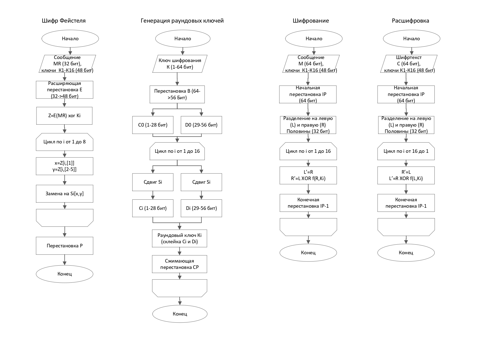
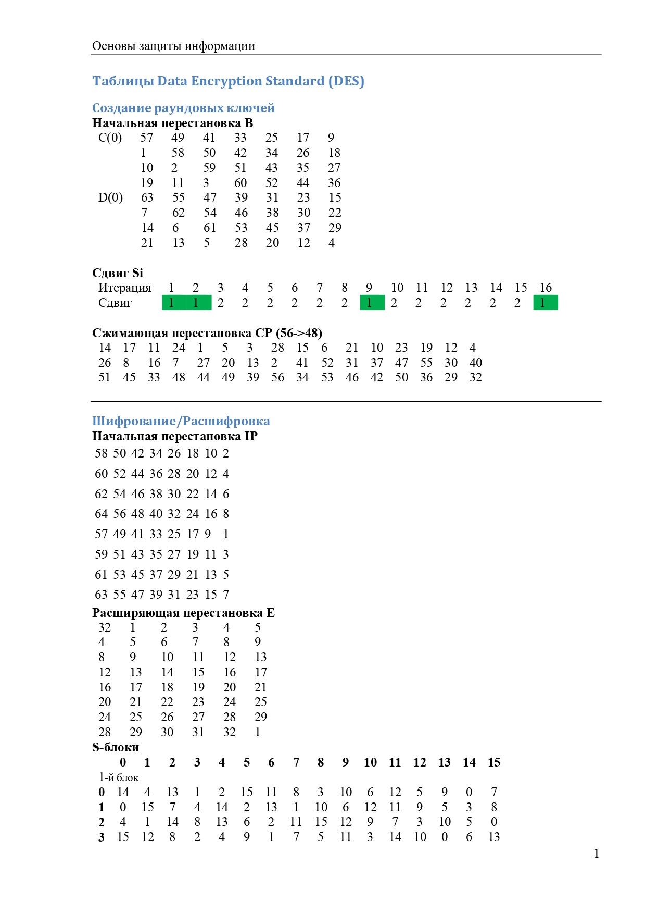
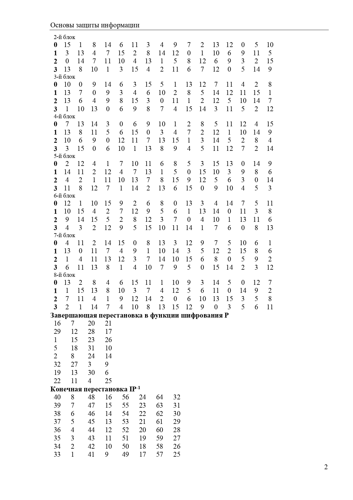
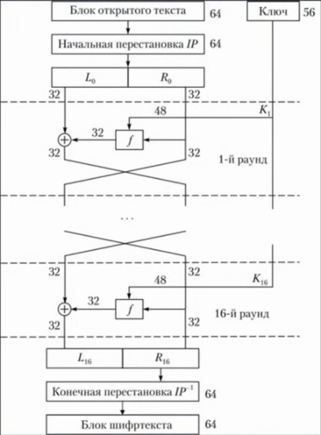
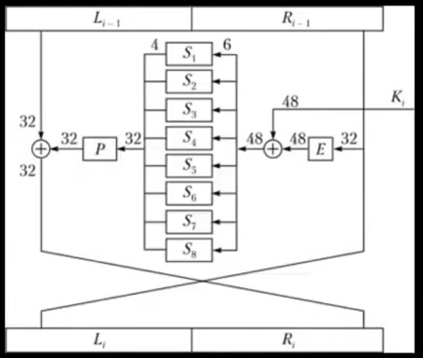
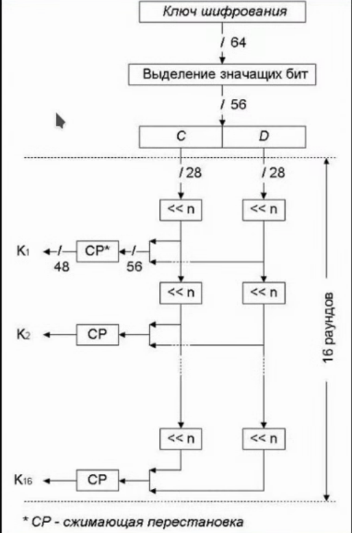

# Лабораторная работа 3 | Laboratory work 3

## Шифр DES | [Data Encryption Standard (DES)](https://en.wikipedia.org/wiki/Data_Encryption_Standard)

### Схема | Schema



### Таблицы | Tables





---

## Пример | Example

Используется режим "электронной кодовой книги" (простая замена).

The [**e**lectronic **c**ode **b**ook mode](https://en.wikipedia.org/wiki/Block_cipher_mode_of_operation#Electronic_codebook_(ECB)) is used.

```
$ make build
go build -o des-ecb main.go
$ ./des-ecb
Usage: ./des-ecb input_file
$ cat data/in/1.txt
qwertyui
$ ./des-ecb data/in/1.txt
Successfully done!
$ cat data/enc/1.txt
<encrypted text>
$ cat data/dec/1.txt
qwertyui
```

## Дополнительные материалы | Additional materials






